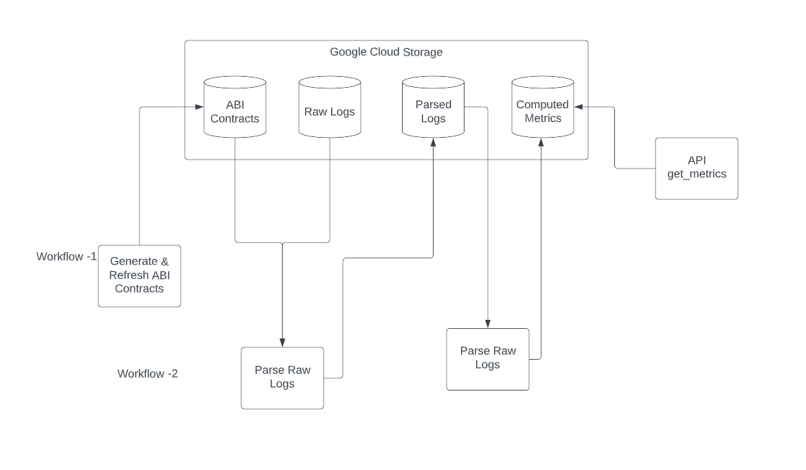

### Problem statement
Use the Ethereum Logs data below to find the most transferred ERC-20 token per month since the Genesis Block. A list of ERC-20 tokens is also provided.

Specifically, measure transfer volume with two metrics: (1) count of transfers and (2) sum of transfer amounts.

The resulting dataset should be two CSVs, one for each metric, each with 3 columns (month, token address, transfer metric).

#### Data

Ethereum Logs (Parquet) are stored in google storage at : 

`gs://rwa-eth-bq-exports/logs`

#### Compute
I have used Databricks community edition workspace as the compute environment for this project.
However, the community eddition's basic 15GB memory single node with 2 cores cluster is not sufficient enough to process the whole data. 

#### Please Notes:
Note: Assumption that we have made is that all the various ECR20 tokens is using the default 18 decimal points for the transfer value.

In order to get the ABI contract for an address I am using EtherScan api's free plan which doesn't support more than 5 calls per second. We do not even have all these ABIs for an address stored which I can use to parse the code. I tried to generate the dictionary of these abi contracts but given we have almost 2000 various tokens and addresses I am not able to do so efficiently with the Community Edition Databricks compute. 
Hence, the code that we have is hard coded for a bunch of addresses with its abi_contracts. Once we have the contract dictionary for all the addresses then with a very minor modification in the log parsing we can easily run these metrics for all the logs.

Also, it appears that we have billions of log events to process and while running the code I am facing issues with databricks community addition cluster's timing out or failing in the middle of the process.

#### Code
There are 2 main files that you see in this repo.
1. utils.py  --> This file contains all the utility functions which are used to parse the ETH logs. It includes functions for getting the abi_contract value for a given address from `etherscan api`; computing various contract's "Transfer" event signature; parsing the topics and data from logs as per the contract's schema.
2. main.py --> This is the main notebook that uses the functions from utils in order to read and process the ethereum logs. It also computes all the metrics that were required in order to solve the problem statement.

#### Optimization

##### 1. Dictionary of ABI contracts for all the various ECR20 tokens.
  I have used the free plan of the etherscan api in order to get the ECR20 tokens which has limitations on number of requests being made per second. It would be nice if we can get these ABIs for various tokens beforehand and keep it ready before processing logs.

##### 2. Partitioning Raw Logs Data
  We should look into partitioning the raw logs data with the block_timestamp in order to optimizing reading data in for processing.

##### 3. Storing api token secrets into a key-vault or databricks secrets.

#### short description of how I would architect a system that offers these outputs as an API for multiple time frames (1D, 1W, 1M, etc.)

  In order to compute these metrics over various timeframes I would follow the below process:

  1. Parse the raw logs into usable data after applying the abi contract schema to another location in the Google Cloud. We should be running these process everyday as a batch job and partition the output data location with yy-mm-dd.
  2. Create a metrics calculation notebooks on top of these parsed logs and compute the metrics required given the required timeframe. The notebook should take as an input the kind of metric needs to be computed and the timeframe.
  3. Create a batch job that can be triggered with an API call. We can create a DAG in airflow, databricks on-demand job or any other orchestrator that supports running the notebook with an api call or function.
  4. We can host a simple rest API that can be exposed to the webclient or customers that accepts the inputs of timeframe and metric to compute and in turn triggers the above mentioned orchestrator batch job.
  5. Also, we can pre-compute these metrics before hand for most generic timeframe for example 1M, 1D and keep them stored for an API to consume. With the above architecture we can run these metrics calculations periodically (daily, weekly) for logs received after the last computations. For one time backfill of the metrics since origin we can just run these metrics calculations process once from origin. 

  I have tried to put this architecture in the following diagram.

#### How to Run
Copy both the notebooks to a databricks workspace and run the `metrics_calculations` Notebook.